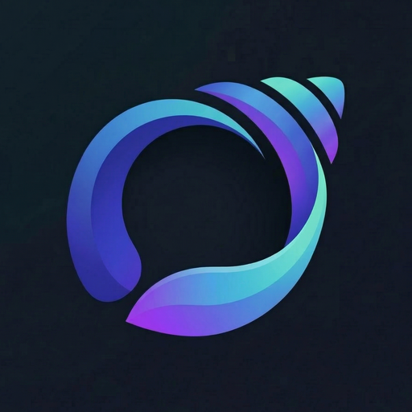
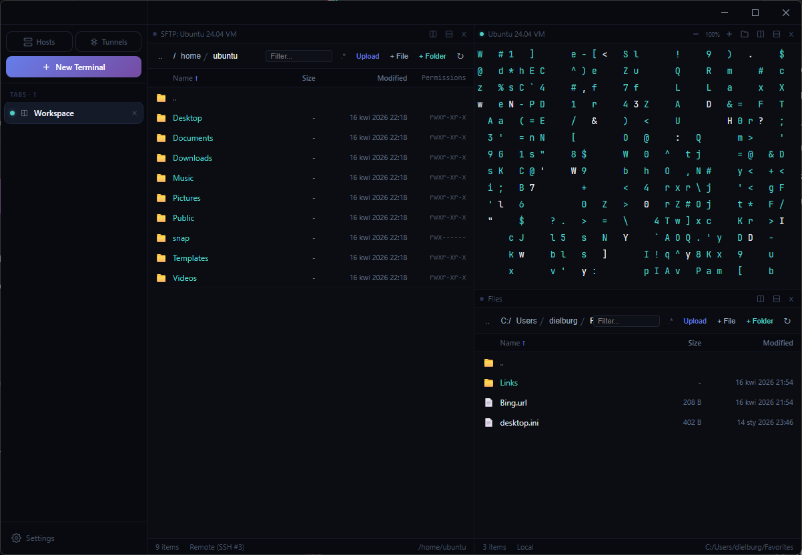
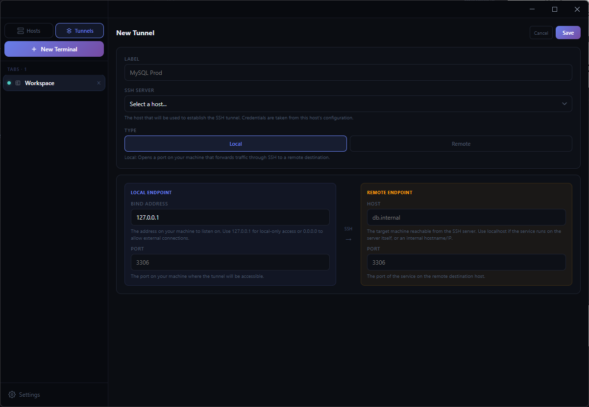

<p align="center">
  
</p>

# shelo

> ⚠️ **Note:** This project is still in its early stages! Expect some rough edges, a few bugs, and missing functionalities as things take shape. If you're cool with that and want to join the ride anyway – thank you so much for being here. Welcome to the `shelo` community! 💙

A free, cross-platform terminal and SSH client inspired by [Termius](https://termius.com/). Built with Tauri, React, and Rust.

The goal behind shelo is simple — I love Termius and its UI approach to terminal management, but wanted a free and open-source alternative that feels just as good. If you've ever wished for a Termius-like experience without the price tag, this is for you.



## Features

- **Multi-panel terminal** — split horizontally and vertically, drag and drop panes between tabs
- **SSH client** — connect to remote servers with password authentication and multi-hop jump host support
- **SFTP file browser** — dual-panel local/remote file management with drag-and-drop transfers, conflict resolution, permissions editor, and keyboard navigation
- **Encrypted vault** — store your host credentials securely with AES-256-GCM encryption and Argon2id key derivation, or unlock automatically via system keychain
- **SSH tunnels** — local and remote port forwarding over SSH, with one-click start/stop and visual connection status
- **Hosts management** — organize connections into groups, one-click connect
- **Workspaces & tabs** — multiple workspaces with reorderable tabs and flexible pane layouts
- **Cross-platform** — runs on macOS, Windows, and Linux with native look and feel

## Installation

Grab the latest release for your platform from the [Releases](https://github.com/dielburg/shelo/releases) page:

| Platform | Architecture | Format |
|----------|-------------|--------|
| macOS | Intel (x64) | `.dmg` |
| macOS | Apple Silicon (arm64) | `.dmg` |
| Windows | x64 | `.exe` |
| Windows | arm64 | `.exe` |
| Linux | x64 | `.deb` / `.AppImage` |
| Linux | arm64 | `.deb` / `.AppImage` |

## Building from source

### Prerequisites

- [Node.js](https://nodejs.org/) (v18+)
- [Rust](https://www.rust-lang.org/tools/install) (stable)
- [Tauri CLI prerequisites](https://v2.tauri.app/start/prerequisites/) for your platform:
  - **macOS**: Xcode Command Line Tools (`xcode-select --install`)
  - **Windows**: Microsoft Visual Studio C++ Build Tools, WebView2
  - **Linux**: system dependencies — on Debian/Ubuntu:
    ```bash
    sudo apt install libwebkit2gtk-4.1-dev build-essential curl wget file libxdo-dev libssl-dev libayatana-appindicator3-dev librsvg2-dev
    ```

### Build

```bash
# Clone the repository
git clone https://github.com/dielburg/shelo.git
cd shelo

# Install frontend dependencies
npm install

# Run in development mode
npm run tauri dev

# Build for production
npm run tauri build
```

The production build output will be in `src-tauri/target/release/bundle/`.

## Screenshots


*Dual-panel SFTP file browser alongside an SSH terminal session*


*SSH tunnel configuration with local and remote port forwarding*